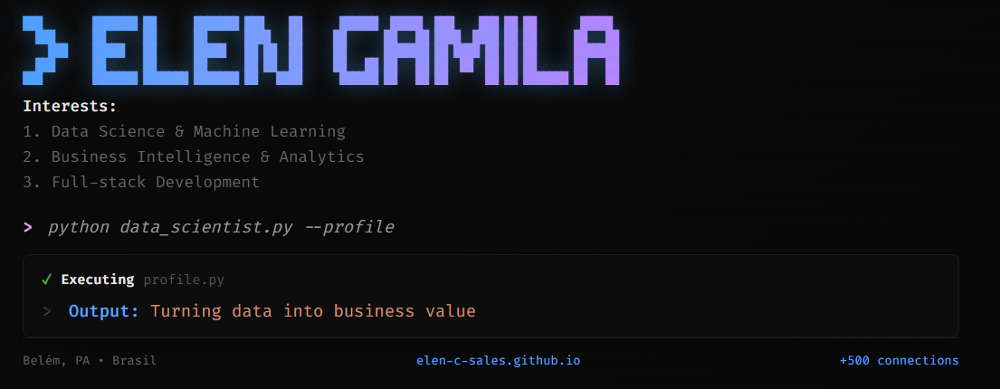

# ASCII Art Cover for LinkedIn

Este projeto cria uma capa personalizada para meu perfil do LinkedIn utilizando arte ASCII, inspirada em interfaces de terminal de código. A capa é renderizada como uma página web estática, otimizada para as dimensões padrão do LinkedIn (aproximadamente 1584x396 pixels).

## Funcionalidades

- **Capa Interativa**: Simula uma sessão de terminal com comandos e outputs, exibindo informações pessoais como interesses, perfil profissional e links.
- **Design Responsivo**: Adaptável para diferentes tamanhos de tela, com layout centralizado.
- **Portfólio Integrado**: Além da capa, inclui seções expandidas sobre o perfil, educação e links para redes sociais e GitHub.
- **Tema Dark**: Utiliza um esquema de cores dark com gradientes sutis para um visual moderno e profissional.

## Tecnologias Utilizadas

- **HTML5**: Estrutura da página.
- **CSS3**: Estilização, incluindo animações e gradientes.
- **GitHub Pages**: Hospedagem gratuita para renderização da página.

## Como Usar

1. Clone ou baixe o repositório.
2. Abra o arquivo `index.html` em um navegador para visualizar.
3. Para usar como capa do LinkedIn:
   - Tire um print screen da seção da capa (a parte superior da página).
   - Faça upload da imagem como capa no LinkedIn.
4. Para hospedar no GitHub Pages:
   - Faça upload dos arquivos para um repositório no GitHub.
   - Ative o GitHub Pages nas configurações do repositório.
   - Acesse via `https://[username].github.io/[repository-name]/`.

## Estrutura do Projeto

- `index.html`: Página principal com a capa e o portfólio.
- `demo/demo.png`: Imagem de demonstração da capa.
- `README.md`: Este arquivo de documentação.

## Link do Projeto

- **Repositório GitHub**: [https://github.com/elen-c-sales/ascii-art-cover](https://github.com/elen-c-sales/ascii-art-cover)
- **GitHub Pages (Demo)**: [https://elen-c-sales.github.io/ascii-art-cover/](https://elen-c-sales.github.io/ascii-art-cover/)

## Personalização

Para personalizar:
- Edite o ASCII art no `<pre>` dentro de `.header-logo`.
- Modifique textos em `.tips`, `.code-content` e seções do portfólio.
- Ajuste cores e estilos nas variáveis CSS em `:root`.

## Licença

Este projeto é de código aberto e pode ser usado livremente para fins pessoais ou profissionais.
